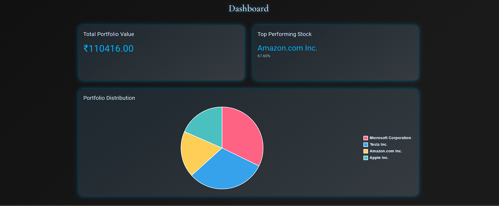
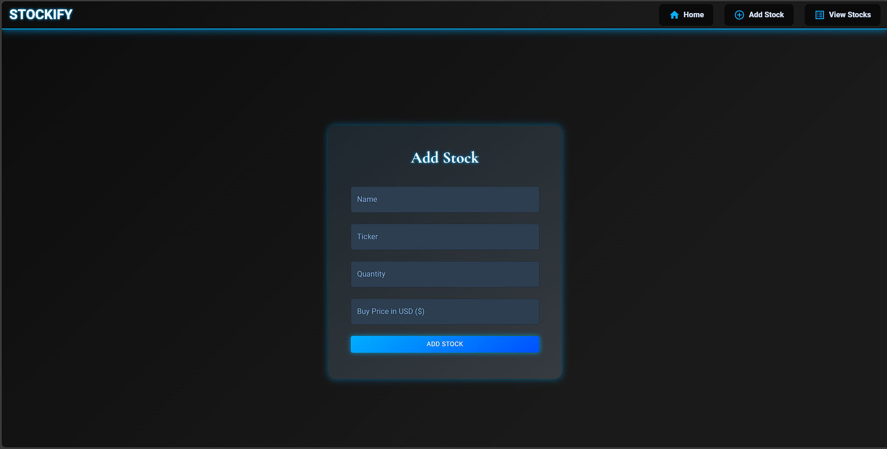
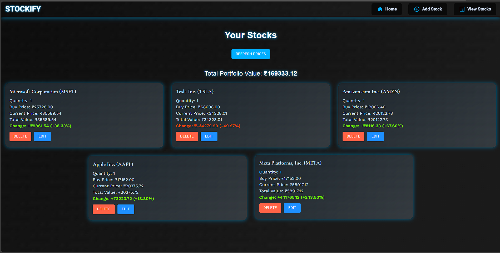

# Stockify - Modern Stock Portfolio Tracker 📈

[](https://reactjs.org/)
[](https://spring.io/projects/spring-boot)
[](https://www.mysql.com/)
[](https://mui.com/)
[](https://www.chartjs.org/)

Stockify is a cutting-edge stock portfolio tracking application featuring a futuristic cyberpunk theme. It empowers users to manage their investments with real-time data visualization, interactive charts, and comprehensive portfolio analytics. Perfect for both individual investors and developers exploring financial technology.

## 📚 Table of Contents
- [Overview](#stockify---modern-stock-portfolio-tracker-)
- [Screenshots](#-screenshots)
- [Key Features](#-key-features)
  - [Current Features](#-key-features)
  - [Upcoming Features](#-upcoming-features)
- [Live Demo](#-live-demo)
- [Installation Guide](#-installation-guide)
  - [Backend Setup](#backend-setup)
  - [Frontend Setup](#frontend-setup)
- [API Reference](#-api-reference)
  - [Stock Management](#stock-management)
  - [Portfolio Analysis](#portfolio-analysis)
- [Technology Stack](#️-technology-stack)
  - [Frontend](#frontend)
  - [Backend](#backend)
  - [DevOps](#devops)
- [Environment Variables](#-environment-variables)
- [Deployment](#-deployment)
  - [Backend (Render)](#backend-render)
  - [Frontend (Vercel)](#frontend-vercel)
- [API Security](#-api-security)

## 📸 Screenshots

### Dashboard Overview

*Main dashboard displaying portfolio overview, real-time metrics, and performance indicators*

### Add Stock Interface

*Intuitive interface for adding new stocks to your portfolio*

### View Stocks Interface

*Interactive charts and graphs showing portfolio distribution and performance*

## 🌟 Key Features

- **Real-time Stock Tracking**: Monitor live stock prices and performance metrics
- **Portfolio Management**: Add, edit, and delete stocks with detailed information
- **Performance Analytics**: View profit/loss calculations and percentage changes
- **Interactive Visualization**: Dynamic charts showing portfolio distribution
- **Top Performers**: Automatically identify and highlight best-performing stocks
- **Responsive Design**: Seamless experience across all devices
- **Cyberpunk UI**: Modern, futuristic interface design

### 🚀 Upcoming Features

- Multi-factor Authentication
- Portfolio Data Export (CSV/PDF)
- Advanced Technical Analysis Tools
- Real-time Price Alerts
- Custom Watchlists
- Dark/Light Theme Toggle

## 🔗 Live Demo

- **Frontend Application**: [Stockify Web App](https://stockify-kavin-narayanan.vercel.app)
- **API Endpoint**: [Backend API](https://stockify-stocks-portfolio-tracker.onrender.com)

## 💻 Installation Guide

### Prerequisites
- Node.js (v14 or higher)
- Java JDK 11 or higher
- Maven
- MySQL
- Alpha Vantage API key

### Backend Setup

```bash
# Clone the repository
git clone https://github.com/kavin-narayanan/Stockify-Stocks.Portfolio.Tracker.git

# Navigate to backend directory
cd portfolio-tracker-backend

# Install dependencies
mvn clean install

# Configure environment variables
export SPRING_DATASOURCE_URL=jdbc:mysql://<hostname>:<port>/<database>
export SPRING_DATASOURCE_USERNAME=<username>
export SPRING_DATASOURCE_PASSWORD=<password>
export ALPHAVANTAGE_API_KEY=<your_api_key>

# Run the application
mvn spring-boot:run
```

### Frontend Setup

```bash
# Navigate to frontend directory
cd portfolio-tracker-frontend

# Install dependencies
npm install

# Start development server
npm start
```

## 📡 API Reference

### Stock Management

| Endpoint | Method | Description | Request Body | Response |
|----------|---------|-------------|--------------|-----------|
| `/stocks/all` | GET | Retrieve all stocks | - | Array of stocks |
| `/stocks/add` | POST | Add new stock | Stock object | Created stock |
| `/stocks/{id}` | GET | Get stock by ID | - | Stock object |
| `/stocks/{id}` | PUT | Update stock | Stock object | Updated stock |
| `/stocks/{id}` | DELETE | Remove stock | - | 204 No Content |
| `/stocks/top-performing` | GET | Get best performing stock | - | Stock object |
| `/stocks/distribution` | GET | Get portfolio distribution | - | Distribution object |

### Portfolio Analysis

| Endpoint | Method | Description | Response |
|----------|---------|-------------|-----------|
| `/portfolio/value` | GET | Get total portfolio value | Portfolio value |
| `/portfolio/metrics` | GET | Get portfolio metrics | Metrics object |

## 🛠️ Technology Stack

### Frontend
- **Core**: React.js
- **UI Framework**: Material-UI
- **Charts**: Chart.js
- **State Management**: React Context
- **HTTP Client**: Axios
- **Styling**: CSS-in-JS

### Backend
- **Framework**: Spring Boot
- **Database**: MySQL
- **API Integration**: Alpha Vantage
- **Security**: Spring Security
- **Documentation**: Swagger/OpenAPI
- **Testing**: JUnit, Mockito

### DevOps
- **Frontend Hosting**: Vercel
- **Backend Hosting**: Render
- **Database Hosting**: Railway
- **CI/CD**: GitHub Actions
- **Version Control**: Git

## 🔧 Environment Variables

```env
SPRING_DATASOURCE_URL=jdbc:mysql://<hostname>:<port>/<database>
SPRING_DATASOURCE_USERNAME=<username>
SPRING_DATASOURCE_PASSWORD=<password>
ALPHAVANTAGE_API_KEY=<your_api_key>
```

## 📦 Deployment

### Backend (Render)
1. Create a new Web Service in Render
2. Connect your GitHub repository
3. Configure environment variables:
   - Add all required environment variables
   - Set build command: `mvn clean install`
   - Set start command: `java -jar target/*.jar`
4. Deploy the application

### Frontend (Vercel)
1. Create a new project in Vercel
2. Import your GitHub repository
3. Configure environment variables
4. Configure build settings:
   - Build command: `npm run build`
   - Output directory: `build`
5. Deploy the application

## 🔐 API Security

- CORS configuration limits access to frontend domain
- API key authentication for stock data access
- Secure database connections with SSL/TLS
- Input validation and sanitization
- Rate limiting for API endpoints

## 🤝 Contributing

Contributions are welcome! Please feel free to submit a Pull Request.

## ⚠️ Known Issues

- Alpha Vantage API has rate limits for free tier
- Initial loading time might be slow due to free tier hosting

---

**Note**: For the most up-to-date stock data, ensure you have a valid Alpha Vantage API key configured in your environment variables.
